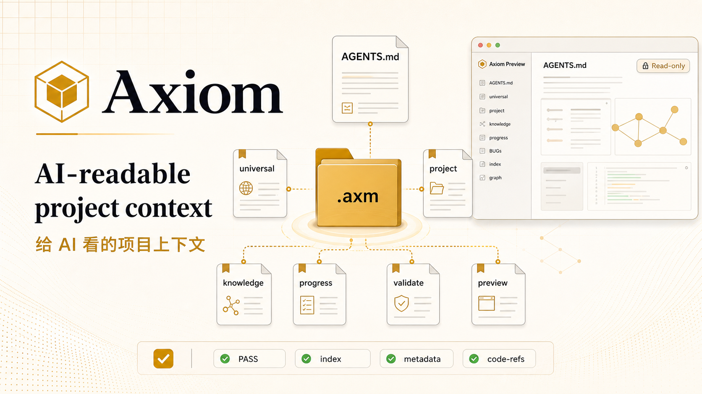
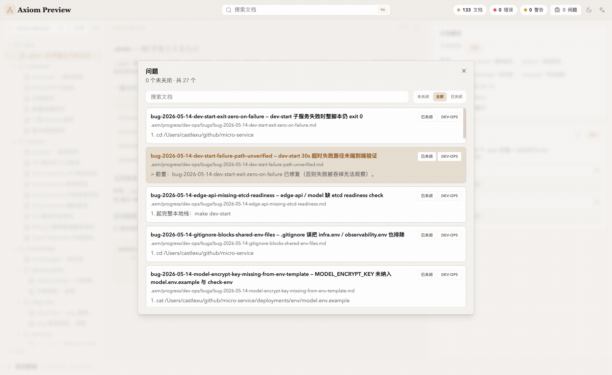

# Axiom

<p align="center">
  <strong>AI-readable project context for code agents.</strong>
</p>

<p align="center">
  English ·
  <a href="README.zh-CN.md">简体中文</a>
</p>

<p align="center">
  <a href="https://github.com/castle-x/axiom/stargazers">
    
  </a>
  
  
</p>

<p align="center">
  
</p>

Axiom is a family of Anthropic Agent Skills for creating, maintaining, auditing, and previewing a project-local `.axm/` knowledge base plus the root `AGENTS.md` entry point.

Instead of asking every new AI coding session to rediscover your repository from `package.json`, directory names, scattered docs, and guesswork, Axiom keeps the durable facts in a predictable structure:

- universal rules that should stay byte-for-byte consistent across projects are released by scripts
- project-specific architecture, coding rules, and knowledge maps are authored by an AI after it reads the codebase
- roadmap, spec, decision, and BUG records share explicit `doc-state` and `workflow-state` metadata
- zero-dependency Node scripts validate the contracts so drift is caught mechanically

The result is a compact context layer that tools such as Claude Code, Codex, OpenCode, and other Agent Skills-aware workflows can read before they touch the code.

### What You Get

| Area | What Axiom provides |
| --- | --- |
| Project memory | `.axm/` knowledge base plus `AGENTS.md` Knowledge Index |
| Skill family | `axm-init`, `axm-maintain`, `axm-progress`, `axm-health-check`, `axm-preview` |
| Mechanical contracts | scaffold, validate, and reindex scripts with no npm dependencies |
| Progress tracking | roadmap / spec / decision / BUG documents with lifecycle metadata |
| Local preview | read-only Axiom Preview for Markdown, metadata, validation, search, bugs, and graph views |

### Axiom Preview

<table>
  <tr>
    <td width="33%" align="center">
      
    </td>
    <td width="33%" align="center">
      
    </td>
    <td width="33%" align="center">
      
    </td>
  </tr>
  <tr>
    <td align="center"><sub>Main interface</sub></td>
    <td align="center"><sub>BUG management</sub></td>
    <td align="center"><sub>Knowledge graph</sub></td>
  </tr>
</table>

### Quick Start

Install the whole skill family:

```bash
git clone https://github.com/castle-x/axiom.git /tmp/axiom
node /tmp/axiom/scripts/install-skills.mjs --target=~/.claude/skills
```

For another Agent Skills directory, replace `--target`, for example:

```bash
node /tmp/axiom/scripts/install-skills.mjs --target=~/.codex/skills
```

Then go to a project root and ask your agent:

```text
Initialize axm for this project
```

The agent should route to `axm-init` and run the five-phase workflow:

| Phase | Owner | Output |
| --- | --- | --- |
| 1. Discover | AI | repository profile for confirmation |
| 2. Scaffold | script | `.axm/universal/`, index skeleton, and `AGENTS.md` skeleton |
| 3. Author | AI | project architecture, coding rules, knowledge docs, Knowledge Index |
| 4. Validate | script | axm-meta, index, code-ref, and AGENTS route checks |
| 5. Handoff | AI | completion summary and remaining TODOs |

Compatibility install is still available: clone this repository into `~/.claude/skills/axm/`. The root `SKILL.md` works as a router to the specific `skills/axm-*` entries.

### Skill Family

| Skill | Use it for |
| --- | --- |
| `axm-init` | initialize `.axm/` and `AGENTS.md` |
| `axm-maintain` | validate axm-meta, sync indexes, repair contract issues |
| `axm-progress` | manage roadmap, spec, decision, and BUG documents |
| `axm-health-check` | audit `.axm/` facts against the current codebase |
| `axm-preview` | download, start, build, or package the read-only previewer |

### Output Layout

```text
<your-project>/
├── AGENTS.md                       # AI root entry point with Knowledge Index
└── .axm/
    ├── index.md
    ├── universal/                  # cross-project rules released by script
    │   ├── docs.md
    │   ├── devloop.md
    │   ├── quality.md
    │   ├── vcs.md
    │   └── review.md
    ├── project/                    # project-specific rules authored by AI
    │   ├── architecture.md
    │   └── coding.md
    ├── knowledge/                  # system knowledge authored by AI
    │   └── <system>/overview.md
    └── progress/
        └── <initiative>/
            ├── roadmap.md
            ├── specs/<spec>.md
            └── bugs/bug-YYYY-MM-DD-<slug>.md
```

### Axiom Preview

`axiom-preview` is a local, read-only browser for `AGENTS.md` and `.axm/`. It binds to `127.0.0.1`, opens a target project, and lets you inspect Markdown, axm-meta, validation summaries, search results, index relationships, Knowledge Graph, and BUG records.

Fastest startup:

```bash
npx @castle-xx/axm-preview --target=/path/to/project --port=8765
```

Persistent install:

```bash
npm install -g @castle-xx/axm-preview
axiom-preview --target=/path/to/project --port=8765
```

Build from this repository:

```bash
cd apps/axm-preview
make build
./bin/axiom-preview --target=/path/to/project --port=8765
```

The previewer does not run scaffold, validate, or reindex from the UI, and it does not write to the target repository.

### Scripts

Use the scripts directly when you want CI or automation without an interactive agent:

```bash
# release the skeleton; refuses to overwrite unless --force is passed
node /path/to/axiom/scripts/scaffold.mjs \
  --owner=<team-or-name> --date=2026-06-01 \
  --project-name=<name> --target=<repo-root>

# validate contracts; exit 0 pass, 1 error, 2 warning
node /path/to/axiom/scripts/validate.mjs --target=<repo-root>

# sync indexes; dry-run first when reviewing changes
node /path/to/axiom/scripts/reindex.mjs --target=<repo-root> --dry-run
node /path/to/axiom/scripts/reindex.mjs --target=<repo-root>
```

Validation checks axm-meta fields and dates, old `status:` metadata, index entries versus real files, `knowledge/**` code-refs, `AGENTS.md` Knowledge Index routes, and progress / BUG placement rules.

### Design Notes

**AI judgment + script copying.** Scripts release the cross-project constitution; AI writes the facts that require reading the target codebase.

**Zero npm dependencies for skill scripts.** `scaffold`, `validate`, and `reindex` only use Node built-in modules. Axiom Preview is the separate Go embedded SPA under `apps/axm-preview/`.

**Stricter contracts make routing easier.** Agents can make better decisions when document state, workflow state, indexes, and code references have predictable shapes.

### FAQ

**Will scaffold overwrite my existing `AGENTS.md`?**

No. The default behavior skips existing files. Use `--force` only when you intentionally want replacement.

**Does this conflict with `CLAUDE.md` or `.cursorrules`?**

No. Keep `AGENTS.md` as the canonical AI context and add a forwarding file when a client only reads another entry point:

```md
# CLAUDE.md
See [AGENTS.md](./AGENTS.md) for the canonical AI context.
```

**Where should universal rules be changed?**

Change `skills/axm-init/templates/axm/universal/*.tpl`, then scaffold or merge into target projects. The point of `universal/` is byte-for-byte consistency.

**Is there an `axm upgrade` command?**

No. `git pull && node scripts/scaffold.mjs --force` handles most template refreshes; edge cases are better merged by an AI that can inspect the project-specific diff.

## Star History

<p align="center">
  <a href="https://www.star-history.com/#castle-x/axiom&Date">
    
  </a>
</p>

## License

MIT
