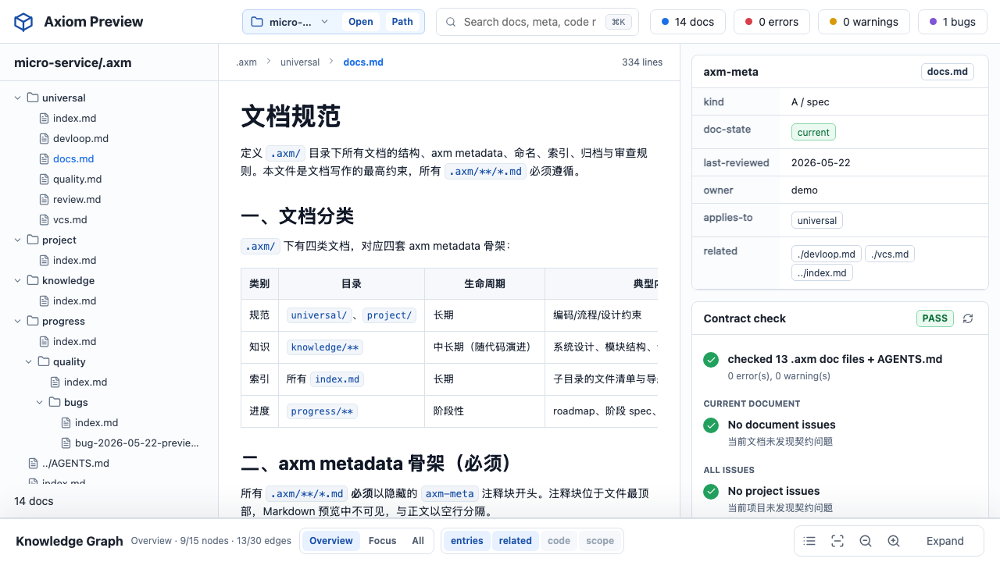
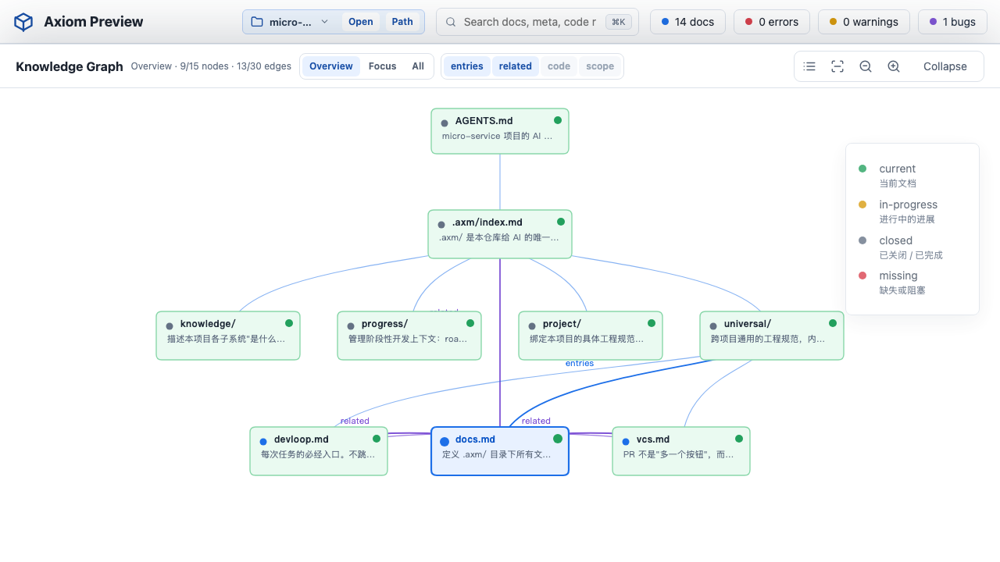

# Axiom

> 给项目一份**给 AI 看的**上下文目录 `.axm/` 与根入口 `AGENTS.md`，让 AI 接手任务时不必每次从零理解你的代码库。

## 它解决什么

每开一个新会话，AI 都要重新扫一遍 `package.json`、目录结构、README，再猜你的架构约束。猜得对当然好，猜错就要返工。

Axiom 把那份"你希望 AI 每次都已经知道的事情"沉淀成项目内的规范文档：

- 跨项目逐字一致的"宪法"（DEVLOOP、文档契约、质量门禁、VCS 规范、二审 review 契约）由脚本释放
- 项目特有的架构、模块边界、源码地图由 AI 读完代码后撰写
- BUG / roadmap / spec 等阶段性内容用 `doc-state` + `workflow-state` 统一骨架管理
- 整套契约由零依赖 Node 脚本机械校验，避免人工漂移

`.axm/` 的设计让 Claude Code、Codex、OpenCode 等支持 [Anthropic Agent Skill](https://www.anthropic.com/engineering/equipping-agents-for-the-real-world-with-agent-skills) 规范的工具直接消费这份上下文。

## 安装

让 AI 帮你安装：

```
帮我安装 https://github.com/castle-x/axiom.git
```

或手动 `git clone` 到本地 skills 目录（如 `~/.claude/skills/axm/`）。

## 用法

### 给一个新项目初始化

到项目根目录，对 AI 说：

```
帮我初始化 axm
```

AI 会按 5 阶段 SOP 执行（详见 `SKILL.md`）：

| 阶段 | 谁做 | 做什么 |
|---|---|---|
| 1. Discover | AI | 扫源码、生成项目画像，给你确认 |
| 2. Scaffold | 脚本 | 释放 `.axm/universal/` 5 份通用规范 + 索引骨架 + `AGENTS.md` 骨架 |
| 3. Author | AI | 写项目特有的 `architecture.md` / `coding.md` / `knowledge/<system>/overview.md`，补全 `AGENTS.md` 路由表 |
| 4. Validate | 脚本 | 校验 axm-meta、index 一致性、code-refs 真实性 |
| 5. Handoff | AI | 输出完成清单与 TODO |

### 已有项目接 axm

- 已有 `AGENTS.md` 但没有 `.axm/`：直接走 5 阶段，scaffold 默认跳过 `AGENTS.md`，AI 后续手动补 Knowledge Index 段
- 已有 `.axm/` 怀疑漂移：跑 Phase 4 校验即可
- 改过 `.axm/**/*.md` 后索引乱了：跑 reindex 同步

### 管理开发进度与 BUG

- **roadmap / spec**：`progress/<initiative>/{roadmap.md, specs/<spec>.md}`，用 axm-meta `workflow-state` 记录当前流程状态，验收标准固定分为 *AI 自动验收* + *人类验收*
- **BUG**：`progress/<initiative>/bugs/bug-YYYY-MM-DD-<slug>.md`，自带优先级（P0–P3）、严重度（Blocker–Trivial）、固定 8 状态生命周期（`open` → `in-progress` → `fixed` → `verified` → `closed`，可走 `reopened` / `wont-fix` / `duplicate`），当前状态同样以 axm-meta `workflow-state` 为准；BUG 必须挂在某个 initiative 下，找不到归属时新建一个（推荐 `progress/quality/`）

对 AI 说"用 axm 提一个 BUG" / "把这个 spec 闭合掉" 即可，AI 会自动遵循 `references/bug-doc-guide.md` 与 `references/progress-doc-guide.md` 的契约。

## 产物长什么样

```
<your-project>/
├── AGENTS.md                       # AI 根入口（含 .axm 召回声明、Knowledge Index）
└── .axm/
    ├── index.md
    ├── universal/                  # 跨项目通用"宪法"
    │   ├── docs.md                 # 四套 axm-meta 骨架契约
    │   ├── devloop.md              # DEVLOOP 状态机
    │   ├── quality.md              # 测试策略 + 质量门禁
    │   ├── vcs.md                  # 分支 + 提交规范
    │   └── review.md               # 二审 review 七条契约
    ├── project/                    # 项目特有规范（AI 写）
    │   ├── architecture.md
    │   └── coding.md
    ├── knowledge/                  # 项目知识（AI 写）
    │   └── <system>/overview.md
    └── progress/
        └── <initiative>/
            ├── roadmap.md              # doc-state + workflow-state
            ├── specs/<spec>.md         # doc-state + workflow-state
            └── bugs/bug-YYYY-MM-DD-<slug>.md
```

## axiom_preview 只读预览器

`axiom_preview` 是 `.axm/` 的本地只读浏览器：启动一个 `127.0.0.1` 服务后，可以通过 `Open` 打开系统文件夹选择器、从项目名下拉切换最近打开的项目，或用 `Path` 输入项目路径。预览器会自动识别项目下的 `.axm/`，不用为每个项目单独开一个服务。

它适合快速查看：

- `AGENTS.md` 与 `.axm/` 文件树
- Markdown 正文、axm-meta（含 `doc-state` / `workflow-state`）与契约校验结果
- 搜索结果、索引关系与 Knowledge Graph
- 最近打开项目的一键切换

文档视图：



Knowledge Graph 视图：



## 直接调用脚本

跳过 AI、放进 CI 或自动化时可独立使用：

```bash
# 释放骨架（默认拒绝覆盖；--force 才覆盖）
node /path/to/axm/scripts/scaffold.mjs \
  --owner=<team-or-name> --date=2026-05-14 \
  --project-name=<name> --target=<repo-root>

# 校验契约（exit 0 PASS / 1 error / 2 warn）
node /path/to/axm/scripts/validate.mjs --target=<repo-root>

# 同步 index（保留已有顺序，追加孤儿，删除失效）
node /path/to/axm/scripts/reindex.mjs --target=<repo-root> [--dry-run]

# 启动只读 localhost 预览器（纯 HTML + Canvas）
node /path/to/axm/scripts/preview.mjs [--target=<repo-root>] [--port=8765]
# 或使用兼容原型图的启动方式
python3 /path/to/axm/axm_preview.py [--target=<repo-root>] [--port=8765]
```

校验四件事：axm-meta 字段完整性 + 日期格式、`index.md` 与同目录实际文件双向一致、`knowledge/**` 的 `code-refs` 指向的源码真实存在、`AGENTS.md` Knowledge Index 引用的 `.axm` 路径可达。

预览器仅展示 `AGENTS.md` 与 `.axm/` 文档、索引关系、axm-meta、校验摘要和 code-refs 路径；Web UI 不提供 scaffold / validate / reindex 执行入口，也不会写入目标仓库。

## 设计取舍

**AI 判断 + 脚本机械**。脚本负责跨项目逐字一致的内容（漂移会让多项目维护者抓狂），AI 负责必须读代码才写得对的内容（架构、源码地图、任务路由）。

**零 npm 依赖**。`git clone` 即用，不需要 `npm install`。脚本全部使用 Node 内置模块。

**契约严过头一点点**。AI 基于确定字段做路由决策，契约越严、推理越稳。对人类来说写 axm-meta 的成本远低于每次猜"这字段该填什么"的成本。

## FAQ

**会覆盖我已有的 `AGENTS.md` 吗？**
不会。scaffold 默认 skip，需要 `--force` 才覆盖。

**与 `CLAUDE.md` / `.cursorrules` 冲突吗？**
不冲突。`AGENTS.md` 是开放标准。客户端只读 `CLAUDE.md` 时建一个转发文件即可：
```md
# CLAUDE.md
See [AGENTS.md](./AGENTS.md) for the canonical AI context.
```

**universal 4 份规范怎么改？**
改 axm 仓库本体里的 `templates/axm/universal/*.tpl`，不是某个用户项目里的副本。跨项目逐字一致是 universal 的核心价值。

**有 `axm upgrade` 同步 universal 升级吗？**
没有。`git pull && node scripts/scaffold.mjs --force` 解决大部分情况；边缘场景让 AI 做 diff 合并比脚本可靠。

## License

MIT
